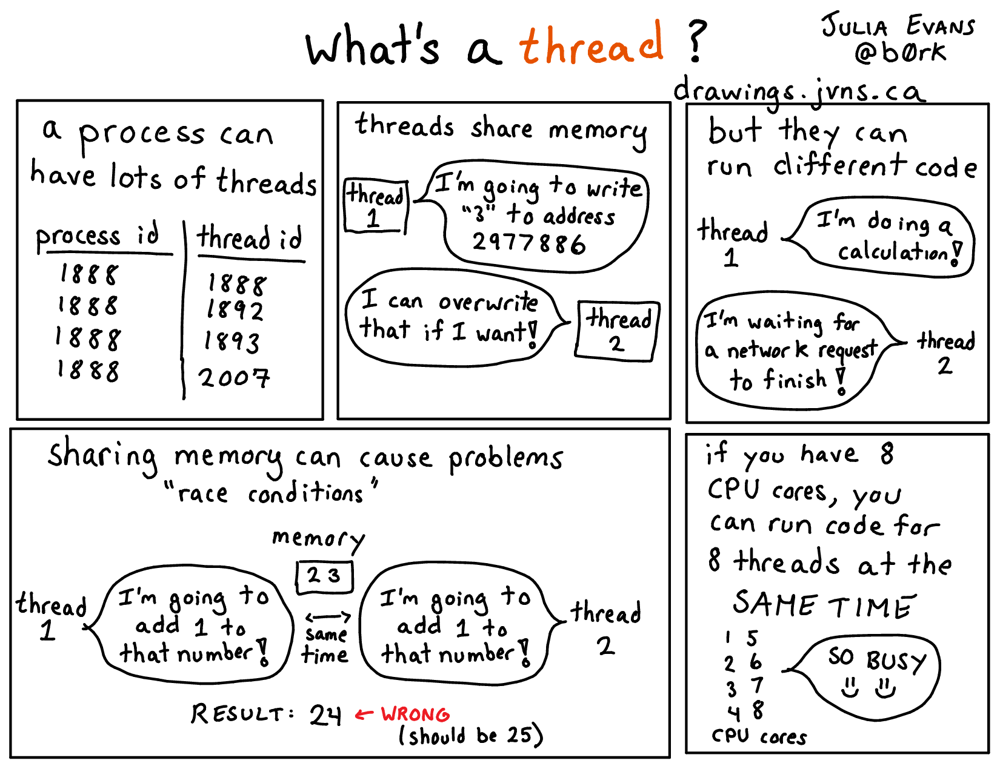

Deadline: End of lab Monday, April 27

## Objectives:
* TSW learn about basic OpenMP directives
* TSW write code to learn two ways of how `#pragma omp for` could be implemented. Learn about false sharing.
* TSW learn about basic multi-processing programming 

## Setup
Pull the Lab 13 files from the lab starter repository with
```
git pull starter master
```

## Part1: Multi-threading programming using OpenMP
OpenMP stands for Open specification for Multi-Processing. It is a framework that offers a C 
interface. It is not a built-in part of the language -- most OpenMP features are directives 
to the compiler. 

Benefits of multi-threaded programming using OpenMP include:
 - Very simple interface allows a programmer to separate a program into serial regions and parallel regions.
 – Convenient synchronization control(Data race bugs in POSIX threads are very hard to trace)
 
In this lab, we will practice on basic usage of OpenMP. 
**Feel free to build and use OpenMP on your own machine, but it would be the easiest to work on hive machines 
as they have OpenMP built and ready for use.**

### Exercise 1 - OpenMP Hello World
Consider the implementation of Hello World (`hello.c`):

```
int main() {
	#pragma omp parallel
	{
		int thread_ID = omp_get_thread_num();
		printf(" hello world %d\n", thread_ID);
	}
}
```

This program will fork off the default number of threads and each thread will print out "hello world" in addition to which thread number it is. You can change the number of OpenMP threads by setting the environment variable `OMP_NUM_THREADS` or by using the [`omp_set_num_threads`](https://gcc.gnu.org/onlinedocs/libgomp/omp_005fset_005fnum_005fthreads.html) function in your program. The `#pragma` tells the compiler that the rest of the line is a directive, and in this case it is omp parallel. `omp` declares that it is for OpenMP and `parallel` says the following code block (what is contained in { }) can be executed in parallel. Give it a try:
` make hello && ./hello `

If you run `./hello` a couple of times, you should see that the numbers are not always in numerical order and will most likely vary across runs. This is because within the parallel region, OpenMP does the code in parallel and as a result does not enforce an ordering across all the threads. It is also vital to note that the variable `thread_ID` is local to a specific thread and not shared across all threads. In general with OpenMP, variables declared inside the parallel block will be private to each thread, but variables declared outside will be global and accessible by all the threads.

## Exercise 2 - Vector Addition

Vector addition is a naturally parallel computation, so it makes for a good first exercise. The `v_add` function inside `v_add.c` will return the array that is the cell-by-cell addition of its inputs x and y. A first attempt at this might look like:

```
void v_add(double* x, double* y, double* z) {
	#pragma omp parallel
	{
		for(int i=0; i<ARRAY_SIZE; i++)
			z[i] = x[i] + y[i];
	}
}
```

You can run this (`make v_add` followed by `./v_add`) and the testing framework will vary the number of threads and time it. You will see that this actually seems to do worse as we increase the number of threads. The issue is that each thread is executing all of the code within the `omp parallel` block, meaning if we have 8 threads, we will actually be adding the vectors 8 times. 
Rather than have each thread run the entire for loop, we need to split up the for loop across all the threads so each thread does only a portion of the work. 

Your task is to optimize `v_add.c` (speedup may plateau as the number of threads continues to increase). To aid you in this process, two useful OpenMP functions are:

* `int omp_get_num_threads();`
* `int omp_get_thread_num();`

The function `omp_get_num_threads()` will return how many threads there are in a `omp parallel` block, and `omp_get_thread_num()` will return the thread ID.

Divide up the work for each thread through two different methods (write different code for each of these methods):

1. First task, **slicing**: have each thread handle adjacent sums: i.e. Thread 0 will add the elements at indices `i` such that `i % omp_get_num_threads()` is `0`, Thread 1 will add the elements where `i % omp_get_num_threads()` is `1`, etc.
2. Second task, **chunking**: if there are N threads, break the vectors into N contiguous chunks, and have each thread only add that chunk (like the figure above).

Hints:
* Use the two functions we listed above somehow in the for loop to choose which elements each thread handles.
* You may need a special case to prevent going out of bounds for `v_add_optimized_chunks`. Don't be afraid to write one.
* Thinking about false sharing--read more [here](https://software.intel.com/en-us/articles/avoiding-and-identifying-false-sharing-among-threads) and [here](https://en.wikipedia.org/wiki/False_sharing).

For this exercise, we are asking you to manually split the work amongst threads since this is a common pattern used in software optimization. The designers of OpenMP actually made the `#pragma omp for` directive to automatically split up independent work. Here is the function rewritten using it. **You may NOT use this directive in your solution to this exercise**.

```
void v_add(double* x, double* y, double* z) {
	#pragma omp parallel for 
	for(int i=0; i<ARRAY_SIZE; i++)
		z[i] = x[i] + y[i];
}
```

Test the performance of your code with `make v_add && ./v_add`

## Exercise 3 - Dot Product

The next task is to compute the dot product of two vectors. At first glance, implementing this might seem not too different from `v_add`, but the challenge is how to sum up all of the products into the same variable (reduction). A sloppy handling of reduction may lead to **data races**: all the threads are trying to read and write to the same address simultaneously. One solution is to use a **critical section**. The code in a critical section can only be executed by a single thread at any given time. Thus, having a critical section naturally prevents multiple threads from reading and writing to the same data, a problem that would otherwise lead to data races. One way to avoid data races is to use the `critical` primitive provided by OpenMP. An implementation, `dotp_naive` in `omp_apps.c`, protects the sum with a critical section. 

Try out the code (`make dotp &&./dotp`). Notice how the performance gets much worse as the number of threads goes up? By putting all of the work of reduction in a critical section, we have flattened the parallelism and made it so only one thread can do useful work at a time (not exactly the idea behind thread-level parallelism). This contention is problematic; each thread is constantly fighting for the critical section and only one is making any progress at any given time. As the number of threads goes up, so does the contention, and the performance pays the price. Can we reduce the number of times that each thread needs to use a critical section? 

Task: fix this performance problem use OpenMP's built-in Reduction keyword.
(Note that your code should no longer contain `#pragma omp critical`. )

Run your code to examine the performance. 

## Part 2: Intro to multi-processing programming 

OpenMP is a convenient way to do multi-threading computation. Another common task level parallelism approach is multiprocessing. 
A thread is a single execution sequence that can be managed independently by the operating system. A process is an instance of a computer program that is being executed. It consists of an address space and one or more threads of control. It is the main abstraction for protection provided by the operating system kernel. 

The key differences between multi-threading and multiprocessing is that in multi-threading, threads share the same address space, whereas in multiprocessing, each process has its own address space. 
Performance wise, this difference leads to two observations: 
1. Threads have lower overhead(low memory and other resource footprint), and the cost of communication between threads is low as in threads can simply read/write to memory addresses in a same address space. 
2. Sharing memory means we have to be careful about concurrency issues: when multiple threads can read/write to the same memory address, it can be hard to reason about correctness. 

</br>

</br>
(credit to [Julia Evans](https://drawings.jvns.ca/))

### Background - Http Web Server and Multi-processing


In the second part of this lab, we will have a very basic but fun practice on writing multi-processing programs. 

The fork syscall is used to create a new process by duplicating the calling process. The new process, referred to as the child, is an exact duplicate of the calling process(read more in the [man page](http://man7.org/linux/man-pages/man2/fork.2.html). Both the newly created process and the
parent process return from the call to fork. On success, the PID of the child process is returned in the parent, and 0 is returned in the child.  

For example, the following code:
```c
#include <stdio.h>
#include <sys/types.h>
#include <unistd.h>
int main () {
  pid_t child_pid;
  printf("Main process id = %d (parent PID = %d)\n",
(int) getpid(), (int)  getppid());
  child_pid = fork();
  if (child_pid != 0)
printf("Parent: child's process id = %d\n", child_pid);
  else
printf("Child:  my process id = %d\n", (int) getpid()); 
  return 0;
}
```
may output:

```
Main process id = 9075 (parent PID = 32146)
Parent: child's process id = 9076
Child:  my process id = 9076
```

The program that we want you to parallelize is a basic HTTP web server. A web server create a listening socket and bind it to a port, then wait a client to connect to the port. Once a connection reqeust reaches, the server obtains a new connection socket, read in and parse the HTTP request, then respond to the request by serving the requested file. For simplicity, the server program that we will be working with only reponds to "GET" requests. 

A serial version is already implemented for you. To start, run `make server_basic && ./server_basic` in command line. 
This server program will run locally using `lab13/files/` as the serve file directory, and listen to port 8000 by default(can be changed from command line argument, for example, `./server_basic --port 8080`). There are two ways to make a request: either open a browser and navigate to `localhost:8000/[request filename]` or use the curl program: run `curl localhost:8000/[request filename]` from the command line. 
If the requested filename refers to a directory, the server first looks for the presence of an **index.html** file. If that is found, that webpage will be served. Otherwise it will present links to each file under the requested directory. 

This server also offers two twists:
* If the request is `localhost:8000/report`, it will run the `dotp` program and serve the result in text. The `arr_size` parameter has a default value set in `omp_apps.c`, but you can change it from command line: `./server_basic --dotp-size 10000000`. 
* It implements the routing feature. If the request is `/filter/[filename].bmp`, it will run a very simple image processing program(specifially, the [sobel edge detector](https://homepages.inf.ed.ac.uk/rbf/HIPR2/sobel.htm) on the requested image, and return a html web page that display the original image and the filtered image together. A few sample bmp images are provided under files directory. 
For example, navigating to `localhost:8000/girl.bmp` should get the original picture, but if you navigate to `localhost:8000/filter/girl.bmp`, your browser should render the following:


Note: If you do this exercise on a hive machine using ssh and want to make client request using your local browser(sadly we can't just go to Soda Hall these days...), you would need to forward traffic through a port of your local machine to the ssh server and have ssh server forward the traffic to the destination server.
To do that, you'd need to connect to a hive machine using -L option. For example:
`ssh -L 4000:127.0.0.1:8000 [login]@hive9.cs.berkeley.edu`
Now, SSH will bind to port 4000 on your computer. Any traffic that comes to this port is sent to the SSH server, and the ssh server will send the traffic
to port 8000 of 127.0.0.1 of the hive machine. Request `localhost:4000` in your browser would allow you to get the same affect as navigating to `localhost:8000` in the browser on a hive machine. 
And, of course, you can use `curl` instead. (`man curl` for more usage of `curl`). 

Optional: 
* The sobel edge detector is implemented for you. Can you optimize it using OpenMP? </br>
(Feel free to implement other image processing algorithms and play with the server anyway you like. :) 

For our purpose here, the details of the server implementation can largely be ignored, but the function `server_forever` defined in `server_utils.c` needs your optimization. In this current implementation, the server program operates on a single process. Once the main process gets a request, it will work on serving the request before coming back greeting the next request. Therefore, if serving one request takes more than a blink -- best luck on clients who need to be served later. </br>
To simulate a costly computation, the request handler is made to wait 5 seconds after it finishes serving the requested file. You can easily observe this inefficiency by making two consecutive requests -- the second one will halt for while before getting a response. </br>
Can we improve the server by some parallelism?  

### Exercise:
Instead of serving a request by the main process running the server program, always fork a new child process to do that and let the parent process continue to greet new requests. 
To test your optimization, run `make server_process && ./server_process`, then make two consecutive requests to any file, verify that the second request is immediately served. 

Note: Forked child processes are not guaranteed to be killed when you kill the parent process from command line by hitting Ctrl+C. 
This may lead to a side effect that the default port 8000 is occupied and you won't be able to restart your server program listening to the same port. 
The way to do it properly is out of scope materials for the purpose of 61c(you will learn to resolve issues like such in cs162, but you're encouraged to figure it out anyway).
We provide a work around here: If a port you attempt to use is occupied by a zombie process, you can kill it using command `fuser -k [port#]/tcp`. 

(FYI: forking a process to respond to a request is probably not the best parallelism approach -- the modern solution is to use a thread pool where the overhead is much lower and you have convenient control over server load.)

## Checkoff

### Part1

#### Exercise 2:
* Show your code for both optimized versions of `v_add` that manually splits up the work. Remember, you should not have used `#pragma omp for` here.
* Run your code to show that it gets parallel speedup.
* Which version of your code runs faster, chunks or adjacent? What do you think the reason for this is? Explain to the person checking you off.

#### Exercise 3:
* Show your manual fix to `dotp.c` that gets speedup over the single threaded case.
* Show your fix for `dotp.c`, and explain the difference in performance.

### Part2
Start your server: `./server_process`, make two consecutive requests to any file, verify that the second request is immediately served. 

